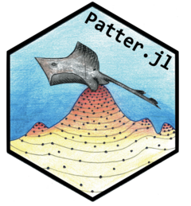

```{r setup, include=FALSE}
knitr::opts_chunk$set(
  collapse = TRUE,
  comment = "#>",
  fig.path = "docs/figures/README-",
  out.width = "100%"
)
```

# `Patter.jl` <a href="https://edwardlavender.github.io/Patter.jl"></a>
**Particle algorithms for animal movement modelling in [`Julia`](https://julialang.org)**

[](https://www.repostatus.org/#active)
[](https://github.com/edwardlavender/Patter.jl/actions/workflows/Documenter.yml)
[](https://github.com/edwardlavender/Patter.jl/actions/workflows/Runtests.yml)
[](https://codecov.io/gh/edwardlavender/Patter.jl)

`Patter.jl` provides particle filtering, smoothing and sampling algorithms for animal movement modelling, with a focus on passive acoustic telemetry systems. The package is heavily based on the [`ParticleFish`](https://github.com/scheidan/ParticleFish.jl) package developed by [Andreas Scheidegger](https://www.eawag.ch/de/ueber-uns/portraet/organisation/mitarbeitende/profile/andreas-scheidegger/show/). `Patter.jl` forms the backend for the [`patter`](https://github.com/edwardlavender/patter) [`R`](https://www.r-project.org) package.

> **Note:**
> `Patter.jl` is a new `Julia` package. Like all new packages, you should use it with a degree of caution. Please share feedback and issues.

# Highlights

`Patter.jl` is designed to reconstruct movement paths and emergent patterns of space use from animal tracking data. A powerful, flexible, process-orientated, particle-based framework is used for this purpose. The essential functions are `particle_filter()` and `particle_smoother_two_filter()`: 

* **`particle_filter()`** is the particle filter. This simulates the possible locations of an individual moving forwards in time, accounting for all of the data (for example, acoustic observations, depth observations and any other observations) _up to_ each time point and the animal's movement (a partial marginal distribution). 
* **`particle_smoother_two_filter()`** is a particle smoothing algorithm. At each time step, the smoother accounts for all of the data from both the past _and_ the future (the full marginal distribution) and substantially refines maps of space use. 

We hope to add backward sampling algorithms to the package in due course. 

# Installation

* Install [`Julia`](https://julialang.org) ≥ v.1.9;

* Install [`Patter.jl`](https://github.com/edwardlavender/Patter.jl):
    - Use `]` in the Julia REPL to open the package manager;
    - Use `add https://github.com/edwardlavender/Patter.jl` to install [`Patter.jl`](https://github.com/edwardlavender/Patter.jl);

You can also [`Patter.jl`](https://github.com/edwardlavender/Patter.jl) via the [`patter`](https://github.com/edwardlavender/patter) [`R`](https://www.r-project.org) wrapper.

# Functionality 

## Abstract types

`Patter.jl` is based on three Abstract Types, defined in `Julia`:

* `State` structures hold the state (location) of an animal at a given time step;
* `ModelMove` structures hold movement model, used to simulate new states;
* `ModelObs` structures hold observation model parameters, used to evaluate the correspondence between simulated states and observations;

## Simulation 

To simulate datasets, use:

* `sim_path_walk()` to simulate a movement path from a walk model (via `ModelMove`);
* `sim_observations()` to simulate observational time series (via `ModelObs`);

## Real-world datasets

To collate real-world datasets, use:

* `assemble_yobs()` to assemble a hash-table of observations and observation model parameters;

This function expects a `Vector` of `DataFrame`s, one for each data type, that comprise a timeline of observations and associated model parameters, and a corresponding `Vector` of observation model (`ModelObs`) sub-types. 

## Modelling

To simulate initial states (i.e., locations) for the particle filter, use: 

* `simulate_states_init()` to simulate states across an area;

To define a movement model, see:

* `?ModelMove` to create a movement model instance;

For available observation models, see:

* `?ModelObs`

To implement the particle filter, use:

* `particle_filter()` to run the filter;

To implement the two-filter smoother, use:

* `particle_smoother_two_filter()` to run the smoother;

# Usage

<!---
In this (hidden) section, we prepare example datasets for analysis, using functions in the wrapper `R` package. Below, these datasets are analysed in `Julia`.
-->

```{r, include = FALSE}
library(patter)
library(JuliaCall)
library(data.table)
library(dtplyr, warn.conflicts = FALSE)
library(dplyr)
```

```{r, include = FALSE}
# Define timeline 
timeline <- seq(as.POSIXct("2016-03-17 01:50:00", tz = "UTC"),
                as.POSIXct("2016-03-18 01:48:00", tz = "UTC"), 
                by = "2 mins")

# Define acoustic detections
det <-
  dat_detections |>
  filter(individual_id == 25L) |>
  mutate(individual_id = NULL) |>
  as.data.table()

# Define archival (depth) observations
arc <-
  dat_archival |>
  filter(individual_id == 25L) |>
  mutate(individual_id = NULL,
         depth_sigma = 50,
         depth_deep_eps = 50) |>
  rename(obs = depth) |>
  as.data.table()

# Assemble acoustic observations 
# "ModelObsAcousticLogisTrunc"
acoustics <- assemble_acoustics(.timeline = timeline,
                                .detections = det,
                                .moorings = dat_moorings)

# Assemble acoustic containers
# "ModelObsAcousticContainer"
containers <- assemble_acoustics_containers(.timeline = timeline,
                                            .acoustics = acoustics, 
                                            .mobility = 750.0)

# Assemble archival observations
# "ModelObsDepthNormalTruncSeabed"
archival <- assemble_archival(.timeline = timeline,
                              .archival = arc)


# Write data.tables to file
write.csv(acoustics, file.path("data", "acoustics.csv"), quote = FALSE, row.names = FALSE)
write.csv(containers$forward, file.path("data", "containers-fwd.csv"), quote = FALSE, row.names = FALSE)
write.csv(containers$backward, file.path("data", "containers-bwd.csv"), quote = FALSE, row.names = FALSE)
write.csv(archival, file.path("data", "archival.csv"), quote = FALSE, row.names = FALSE)
terra::writeRaster(dat_gebco(), file.path("data", "bathymetry.tif"), overwrite = TRUE)
```

## Set up 

This is the basic `Patter.jl` workflow to reconstruct movement paths and patterns of space use from animal tracking data. First, we load some essential packages:

```{julia}
# Activate project
using Pkg
Pkg.activate(".")
using Patter

# Load supporting packages
import ArchGDAL
import CSV
using DataFrames
using Dates
using Distributions
import GeoArrays
using Plots
import Random
using Rasters
using RCall
```

Next, we set the seed to ensure reproducibility of our simulations and check the number of threads:

```{julia}
# Set seed
Random.seed!(123);

# Check threads
Threads.nthreads()
```

Third, we define the properties of our study area; namely, a `Raster` and `GeoArray` of our study area that defines the environment within which movements are possible and the timeline over which we will model movements:

```{julia}
# Read a UTM bathymetry rasters that defines the 'environment' within which movements occurred
# * `env_init` is a Raster that is used for sampling initial states (locations)
# * `env` is a GeoArray that is used by the algorithms (faster)
env_init = Patter.rast(joinpath("data", "bathymetry.tif"));
env      = GeoArrays.read(joinpath("data", "bathymetry.tif"));

# Define a timeline for the analysis
# * This specifies the time period and resolution of the analysis
timeline = collect(DateTime("2016-03-17T01:50:00"):Minute(2):DateTime("2016-03-18T01:48:00"));
```

## Movement

We will reconstruct the movements of a tagged flapper skate (_Dipturus intermedius_) within a study area off the west coast of Scotland, based on electronic tagging and tracking data. To do so, we need a model for the individual's movements and a series of observation models that connect movements to observations. In this example, we are interested in the two-dimensional (x, y) location of our animal through time (that is, the animal's 'state' is an object of type `StateXY`). The animal can move up to 750 m in two minutes, which is the resolution at which we will model movement, and we formulate a random walk model (using a `ModelMove` structure) accordingly based on step lengths and headings:

```{julia}
# Formulate a movement model
model_move = ModelMoveXY(env, 
                         750.0,
                         truncated(Gamma(1, 250.0), upper = 750.0), 
                         Uniform(-pi, pi));
```

```{julia}
# Simulate realisation(s) of the movement model
path = simulate_path_walk(xinit = [StateXY(67.87914, 708817.4, 6259203)], 
                          model_move = model_move, 
                          timeline = timeline)

# Extract x and y coordinates for visualisation
x = [path[1, i].x for i in 1:size(path, 2)];
y = [path[1, i].y for i in 1:size(path, 2)];

# Visualise the simulated movement path
p = plot(env, xticks = 5, yticks = 5);
scatter!(p, x, y, color = :red, label = false);
display(p)
```

See `?State` and `?ModelMove` for built-in `State`s and movement models. Define a custom sub-type via `struct StateCustom <: Patter.State` or `struct ModelMoveCustom <: Patter.ModelMove` and see the help files for the additional methods that need to be provided. 

## Observations

We have collected acoustic and archival (depth) observations from tagged flapper skate. Here, we load the time series for a selected individual. For analysis using `Patter.jl`, each dataset must comprise: a `timestamp` column, that defines the time of an observation; a `sensor_id` that distinguishes sensors (such as acoustic receivers), an `obs` column that defines the observation (`0` or `1` in the case of acoustic observations); and additional columns that define the parameters of an observation model (`ModelObs`) structure that links movement to the observations. The time series include (a) a standard acoustic dataset, a corresponding dataset of acoustic containers and a standard archival dataset. The acoustic containers dataset is derived from the acoustic dataset and defines the maximum possible distance of the individual from the receiver(s) that recorded the next detection(s) at each time step. This dataset facilitates convergence in the particle filter. The wrapper `patter` package contains helper routines for the assembly of these datasets, if required.

```{julia}
# Read acoustic (0, 1) observations
acoustics = CSV.read(joinpath("data", "acoustics.csv"), DataFrame);
first(acoustics, 6)

# Read acoustic containers looking 'forwards' or 'backwards' in time
containers_fwd = CSV.read(joinpath("data", "containers-fwd.csv"), DataFrame);
first(containers_fwd, 6)
containers_bwd = CSV.read(joinpath("data", "containers-bwd.csv"), DataFrame);
first(containers_bwd, 6)

# Read archival (depth) observations
archival = CSV.read(joinpath("data", "archival.csv"), DataFrame);
first(archival, 6)
```

Individual movements are connected to the observations by models of the observation process for each dataset. Without going into details, here we bundle together the observations with the parameters of the observation models in a typed dictionary for analysis:

```{julia}
# Process time stamps
acoustics.timestamp      = DateTime.(acoustics.timestamp, "yyyy-mm-dd HH:MM:SS");
containers_fwd.timestamp = DateTime.(containers_fwd.timestamp, "yyyy-mm-dd HH:MM:SS");
containers_bwd.timestamp = DateTime.(containers_bwd.timestamp, "yyyy-mm-dd HH:MM:SS");
archival.timestamp       = DateTime.(archival.timestamp, "yyyy-mm-dd HH:MM:SS");

# Collate datasets & associated `ModelObs` instances into a typed dictionary 
# * Acoustic containers are direction specific, so two datasets are required
# * (for forward & backward runs of the particle filter, respectively)
datasets_fwd        = [acoustics, containers_fwd, archival];
datasets_bwd        = [acoustics, containers_bwd, archival];
model_obs_types     = [ModelObsAcousticLogisTrunc, 
                       ModelObsAcousticContainer, 
                       ModelObsDepthNormalTruncSeabed];
yobs_fwd            = assemble_yobs(datasets = datasets_fwd,
                                    model_obs_types = model_obs_types);
yobs_bwd            = assemble_yobs(datasets = datasets_bwd,
                                    model_obs_types = model_obs_types);
```

Of course, you do not need acoustic and archival data to implement the algorithms: these are just the data we have collected from flapper skate and they are convenient to illustrate because we have built-in corresponding `ModelObs` sub-types into the package. However, other datasets can be incorporated almost as easily via custom `ModelObs` sub-types (that is, `struct ModelObsCustom <: Patter.ModelObs`) and some supporting methods (see the package help files for details). To simulate observations instead, see `simulate_yobs()`. 

## Particle filter

We are now in a position to run the particle filter. This runs a simulation forwards (or backwards) in time, sampling states (locations, termed 'particles') that are consistent with the movement model and the observations up to and including each time point. We end up with a time series (`Matrix`) of particles (`State` instances) that approximate the partial marginal distribution for the location of the animal at each time step:

```{julia}
# Simulate initial states for the forward filter
xinit = simulate_states_init(map             = env_init, 
                             timeline        = timeline, 
                             state_type      = StateXY,
                             xinit           = nothing, 
                             model_move      = model_move, 
                             datasets        = datasets_fwd,
                             model_obs_types = model_obs_types,
                             n_particle      = 2000, 
                             direction       = "forward", 
                             output          = "Vector");

# Run the forward filter
fwd = particle_filter(timeline   = timeline,
                      xinit      = xinit,
                      yobs       = yobs_fwd,
                      model_move = model_move,
                      n_record   = 1000,
                      direction  = "forward");

# Simulate initial states for the backward filter
xinit = simulate_states_init(map             = env_init, 
                             timeline        = timeline, 
                             state_type      = StateXY,
                             xinit           = nothing, 
                             model_move      = model_move, 
                             datasets        = datasets_bwd,
                             model_obs_types = model_obs_types,
                             n_particle      = 2000, 
                             direction       = "backward", 
                             output          = "Vector");

# Run the backward filter
bwd = particle_filter(timeline   = timeline,
                      xinit      = xinit,
                      yobs       = yobs_bwd,
                      model_move = model_move,
                      n_record   = 1000,
                      direction  = "backward");

```

The filter returns a `NamedTuple` that defines the time steps of the simulation, the simulated `State`s and other algorithm diagnostics.

```{julia}
# Forward run outputs
fwd.states
fwd.diagnostics
fwd.callstats
fwd.callstats.convergence
fwd.callstats.time

# Backward run outputs
bwd.states
bwd.diagnostics
bwd.callstats
bwd.callstats.convergence
bwd.callstats.time
```

## Particle smoother

Particle smoothers refine the outputs from the particle filter. Smoothed particles approximate the full marginal distribution for the location of the individual at each time step (accounting for all of the data before and after each step):

```{julia}
# (optional) Set vmap to improve speed here
n_particle = 750;
smo = particle_smoother_two_filter(timeline   = timeline,
                                   xfwd       = fwd.states[1:n_particle, :],
                                   xbwd       = bwd.states[1:n_particle, :],
                                   model_move = model_move,
                                   vmap       = nothing,
                                   n_sim      = 100, 
                                   cache      = true);

# Smooth outputs
smo.states
smo.diagnostics
smo.callstats
smo.callstats.convergence
smo.callstats.time
```

# Mapping

Particles can be used to reconstruct movement paths and patterns of space use. At the time of writing, `Patter.jl` focuses entirely on the provision of fast particle algorithms and lacks supporting routines for mapping and visualisation. However, we can easily estimate a utilisation distribution from `Julia` using the wrapper `patter` `R` package via `RCall` (on Windows and MacOS). This is the `R` code:

```{R, message = FALSE}
# Load & attach packages
library(patter, quietly = TRUE)
library(spatstat.explore, quietly = TRUE, warn.conflicts = FALSE)
op <- options(terra.pal = rev(terrain.colors(256)))
              
# Read map 
map <- terra::rast(file.path("data", "bathymetry.tif"))

# Convert smoothed particles from `Julia` into a `pf_particles` object
smo <- patter:::pf_particles(.pf_obj = "smo")

# Estimate UD
ud <- map_dens(.map     = map,
               .coord   = smo$states,
               .sigma   = bw.h, 
               .verbose = FALSE)$ud

# Add home range
map_hr_home(ud, .add = TRUE)
mtext(side = 4, "Probability density", line = -3)

options(op)
```

This basic workflow is highly customisable. You have the flexibility to define species-specific movement models, include any type of observational dataset and implement system-specific observation models. See the function examples for further details and reach out with queries. 

# Resources

**For full details on the methods**, see the references below. 

**For further information of the `Patter.jl` package**, see:

* The [online](https://edwardlavender.github.io/Patter.jl/) package documentation;
* `?patter::particle_filter()` for information on specific functions;

**For additional resources**, see the documentation for the [`patter`](https://github.com/edwardlavender/patter) `R` package. 

# Disclaimer and troubleshooting 

`Patter` is a new `Julia` package. All routines are experimental. Researchers interested in using the package are encouraged to get in touch while the methods and package remain at an early stage of evolution (edward.lavender@eawag.ch). 

# Citation 

To cite `patter` in publications, please use:

* Lavender, E. et al. (2023). An integrative modelling framework for passive acoustic telemetry. Methods in Ecology and Evolution. https://doi.org/10.1111/2041-210X.14193 
* Lavender, E. et al. (in prep). Particle algorithms for animal movement modelling in autonomous receiver networks.
* Lavender, E. et al. (in prep). Particle algorithms for animal tracking in `R` and `Julia`. https://doi.org/10.1101/2024.07.30.605733
* Lavender, E. et al. (in prep). Particle filtering reveals patterns of space use in a Critically Endangered elasmobranch.

---

Please note that `patter` is released with a [Contributor Code of Conduct](https://contributor-covenant.org/version/2/1/CODE_OF_CONDUCT.html). By contributing to this project, you agree to abide by its terms.
