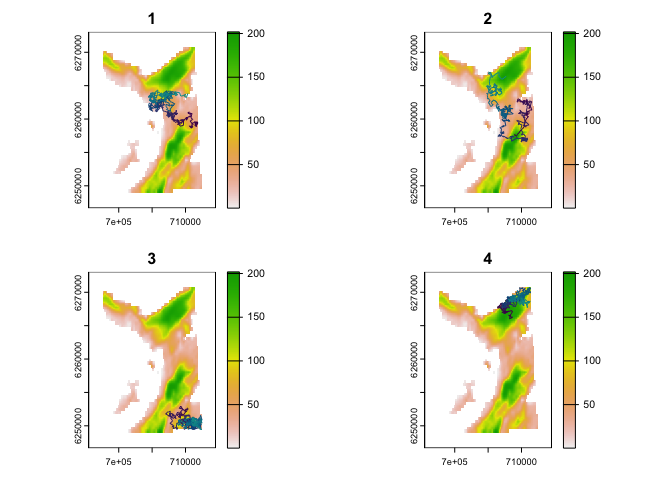
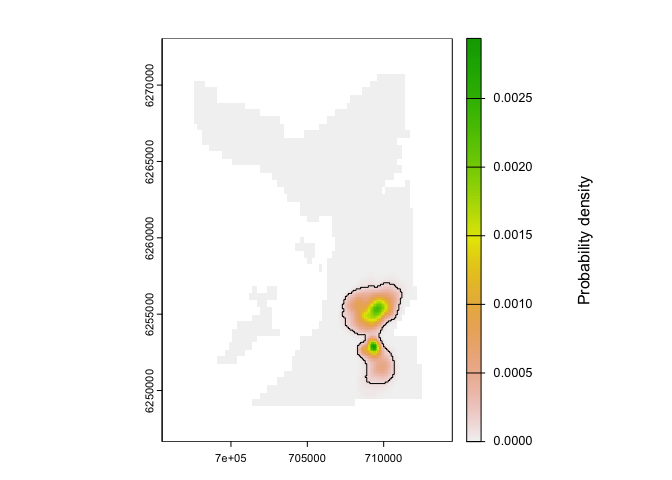

# `patter`: particle algorithms for animal movement

**Particle filters, smoothers and sampling algorithms for animal
movement modelling in [`R`](https://www.r-project.org)**

<!-- badges: start -->

[](https://www.repostatus.org/#active)
[](https://lifecycle.r-lib.org/articles/stages.html#experimental)
[](https://CRAN.R-project.org/package=patter)

[](https://github.com/edwardlavender/patter/actions/workflows/R-CMD-check.yaml)
<!-- badges: end -->

`patter` provides particle filtering, smoothing and sampling algorithms
for animal movement modelling, with a focus on passive acoustic
telemetry systems. This wraps and enhances a fast `Julia` backend
([`Patter.jl`](https://edwardlavender.github.io/Patter.jl)). The
methodology enables the reconstruction of movement paths and patterns of
space use. `patter` unifies a suite of methods formerly known as the
[`flapper`](https://github.com/edwardlavender/flapper) algorithms and
supersedes the experimental
[`flapper`](https://github.com/edwardlavender/flapper) package (Lavender
et al., [2023](https://doi.org/10.1111/2041-210X.14193)).

> **Note:** `patter` is a new `R` package. Like all new packages, you
> should use it with a degree of caution. Please share feedback and
> issues.

# Highlights

`patter` is designed to reconstruct movement paths and emergent patterns
of space use from animal tracking data. A powerful, flexible,
process-orientated, particle-based framework is used for this purpose.
This framework unifies the
[`flapper`](https://github.com/edwardlavender/flapper) algorithms and
provides important opportunities for development, which we exploit here.

The essential functions are `pf_filter()` and `pf_smoother_*()`:

- **`pf_filter()`** is the particle filter. This simulates the possible
  locations of an individual moving forwards in time, accounting for all
  of the data (for example, acoustic observations, depth observations
  and any other observations) *up to* each time point and the animal’s
  movement (a partial marginal distribution).
- **`pf_smoother_*()`** is a particle smoothing algorithm. At each time
  step, the smoother accounts for all of the data from both the past
  *and* the future (the full marginal distribution) and substantially
  refines maps of space use.

We hope to add backward sampling algorithms to the package in due
course.

# Evolution

`patter` evolved from the experimental
[flapper](https://github.com/edwardlavender/flapper) package, but is:

- **More powerful**, with a substantially revised methodology;
- **Faster**, with overhauled internal routines;
- **Simpler** to use and maintain;
- **Stable**, with fewer dependencies and an upgraded spatial ecosystem;
- **Better tested**, with comprehensive unit tests (in progress!);

See [`NEWS`](https://github.com/edwardlavender/patter/blob/main/NEWS.md)
for a summary of the evolution of
[`flapper`](https://github.com/edwardlavender/flapper) to `patter`.

At the time of writing (May 2024), `patter` is more streamlined than
[`flapper`](https://github.com/edwardlavender/flapper) and focuses on
the implementation of fast particle-based algorithms for the
reconstruction of movements and patterns of space use. Please get in
touch if you would like to see additional functionality brought into
`patter`.

# Installation

> **Note:** `patter` currently works on Windows and MacOS. On Windows,
> everything *should* work if you follow the instructions below. On
> MacOS, some additional set up (such as compiler configuration) may be
> required, depending on your set up. In our (limited) experience,
> `patter` installs but crashes on Debian/Ubuntu. This is due to a
> conflict between the GDAL/GEOS/PROJ libraries used by `R` and `Julia`
> (which we hope to solve in due course). Please let us know your
> experiences if you are using other Linux distributions. In case of
> issues, you should be able to use `Patter.jl` directly, which on some
> systems may be simpler than getting `R` and `Julia` to play together!

1.  **Install [`R`](https://www.r-project.org)**. This package requires
    `R` version ≥ 4.1 (but the most recent version is recommended). You
    can check your version from the `R` console using
    `R.version.string`.

2.  **Install build packages.** Package installation and configuration
    (may) require the [`devtools`](https://github.com/r-lib/devtools),
    [`pkgbuild`](https://github.com/r-lib/pkgbuild) and
    [`here`](https://github.com/r-lib/here) packages. Install them with:

``` r
install.packages(c("devtools", "pkgbuild", "here"))
```

3.  **Install system libraries**.

- **On Windows**, package building requires `RTools`. You can check
  whether `RTools` is installed with `pkgbuild::has_rtools()`. If
  `RTools` is not installed, it is necessary to download and install the
  appropriate version of `RTools` before proceeding by following the
  instructions [here](https://cran.r-project.org/bin/windows/RTools/).
- **On MacOS**, some system-specific step up (e.g., compiler
  configuration) may be required. Follow the steps below and address any
  issues as required for your system.
- **On Linux**, our experience is currently limited—please share yours.

4.  **Install [`Julia`](https://julialang.org)**. `Julia` is
    high-performance programming language that `patter` uses as a
    backend. If you do not have `Julia` installed on your system, you
    can install `Julia` via `R` using `JuliaCall`:

``` r
# Install the {JuliaCall} package:
install.packages("JuliaCall")
```

``` r
# Install `Julia` via {JuliaCall}:
library(JuliaCall)
julia <- julia_setup(installJulia = TRUE)
```

``` r
# Validate the Julia installation:
# * TRUE: `Julia` is working! 
# * FALSE: `Julia` is not working (see below)! 
isTRUE(try(julia_eval('true'), silent = TRUE))
```

If this doesn’t work, download and install `Julia` from
[JuliaLang](https://julialang.org/downloads/). Then retry
`julia_setup()`:

``` r
julia <- julia_setup()
isTRUE(try(julia_eval('true'), silent = TRUE))
```

If you run into issues at this stage, it is likely that `Julia` has not
been installed properly or `R` can’t find it. You may need to tell `R`
the location of the `Julia` binary via `JULIA_HOME` (see
`?JuliaCall::julia_setup()` and the
[`JuliaCall`](https://cran.r-project.org/web/packages/JuliaCall)
[README](https://cran.r-project.org/web/packages/JuliaCall/readme/README.html)
for troubleshooting and ways to get help).

5.  **Install [`patter`](https://github.com/edwardlavender/patter).** To
    install `patter` from the `main` branch, use:

``` r
devtools::install_github("edwardlavender/patter", 
                         dependencies = TRUE, 
                         build_vignettes = TRUE)
```

The `dependencies = TRUE` argument ensures that suggested packages are
also installed, which are required for some functions and to build
vignettes. This process may take several minutes. Set
`build_vignettes = FALSE` for a faster installation.

To install `patter` from the development (`dev`) branch, if available,
use:

``` r
devtools::install_github("edwardlavender/patter@dev", 
                         dependencies = TRUE, 
                         build_vignettes = TRUE)
```

This branch may include bug fixes and new features but should be used
with caution.

We recommend using
[`renv`](https://rstudio.github.io/renv/articles/renv.html) (or similar)
and [RStudio Projects](https://r4ds.had.co.nz/workflow-projects.html) to
track the version of `patter` that you use in your projects. This will
ensure that your code continues to work, even if we have to make
breaking changes to `patter` as the package evolves in response to user
feedback.

6.  **Connect to `Julia`**. At the start of every `R` session, you need
    to connect `R` to `Julia` (and `patter` to
    [`Patter.jl`](https://github.com/edwardlavender/Patter.jl)):

``` r
# Load & attach {patter}:
library(patter)

# Option (A): Connect to `Julia` using default options: 
julia <- julia_connect()

#  Option (B): Connect to `Julia` within an RStudio Project (recommended):
julia <- julia_connect(JULIA_PROJ = here::here("Julia"))
```

The first time you run `julia_connect()`, it will connect to `Julia` and
install (and pre-compile)
[`Patter.jl`](https://github.com/edwardlavender/Patter.jl) and the
additional `Julia` dependencies. This may take a few minutes. Subsequent
`julia_connect()` calls will be faster.

7.  **Validate the `R`—`Julia` connection**. To validate that `patter`
    works on your system, run:

``` r
julia_validate()
```

This should return `NULL`, invisibly, in which case you are good to go.
Otherwise, the function will return an error (or `R` may crash). Please
report any [issues](https://github.com/edwardlavender/patter/issues) you
experience during this process.

# Functionality

## Vignettes

For an introduction to `patter`, use:

- `vignette("a-methodology", package = "patter")` for a conceptual
  introduction to the methodology;
- `vignette("b-workflow-outline", package = "patter")` for an overview
  of the workflow;

For a full list of all functions, see `help(package = 'patter')`.

For a glossary of key arguments, see `glossary`.

## Datasets

For example datasets from the Movement Ecology of Flapper Skate project
(`datasets-mefs`), which inspired `patter`, see:

- `dat_moorings` for acoustic receiver deployments;
- `dat_acoustics` for acoustic time series;
- `dat_archival` for archival (depth) time series;
- `dat_gebco()` for a bathymetry grid;

To validate new datasets for use with `patter`, see `pat_setup_data()`
and/or the `assemble_*()` function documentation.

For example algorithm outputs (`datasets-algorithms`), see:

- `dat_path()` for an example output from `sim_path_walk()`;
- `dat_coa()` for an example output from `coa()`;
- `dat_pff()` and `dat_pfb()` for an example output from `pf_filter()`;
- `dat_tff()` for an example output from `pf_smoother_two_filter()`;

## Set up `Julia`

To link `patter` and the
[`Patter.jl`](https://edwardlavender.github.io/Patter.jl) `Julia`
backend, use:

- `julia_connect()` to connect to `R` to `Julia`;
- `julia_validate()` to validate the `R`—`Julia` connection;
- `set_seed()` to set the seed in `R` and `Julia`;
- `set_map()` to make a `SpatRaster` of the study area available in
  `Julia`;

These functions should be run at the start of every `R` session.

## Abstract Types

`patter` is based on three Abstract Types, defined in `Julia`:

- `State` structures hold the state (location) of an animal at a given
  time step;
- `ModelMove` structures hold movement model, used to simulate new
  states;
- `ModelObs` structures hold observation model parameters, used to
  evaluate the correspondence between simulated states and observations;

## Simulation

To simulate animal movement time series, see:

- `sim_path_walk()` to simulate a movement path from a walk model (via
  `ModelMove`);
- `sim_array()` to simulate an acoustic array;
- `sim_observations()` to simulate observational time series (via
  `ModelObs`);

To evaluate model skill in reconstructing simulated patterns, see
`skill_*()` functions:

- `skill_mb()` to calculate mean bias;
- `skill_me()` to calculate mean error;
- `skill_rmse()` to calculate root mean squared error;
- `skill_R()` to calculate Spearman’s rank correlation coefficient;
- `skill_d()` to calculate the index of agreement;

## Data exploration

For help with data acquisition, processing, checking and preliminary
analyses, see the [`flapper`](https://github.com/edwardlavender/flapper)
package. This facilitates:

- Data preparation;
- Spatial operations;
- Distance calculations;
- Movement analyses;

Please submit a [feature
request](https://github.com/edwardlavender/patter/issues) if you would
like functions from
[`flapper`](https://github.com/edwardlavender/flapper) in `patter`.

## Algorithms

The main thrust of `patter` is the provision of fast, integrated
modelling workflow based on particle filtering for reconstructing animal
movement paths and emergent patterns of space use from observational
time series (with a focus on passive acoustic telemetry systems).

**To assemble datasets for particle filtering**, use `assemble_*()`
functions:

- `assemble_timeline()` assembles a timeline;
- `assemble_acoustics()` assembles an acoustic time series;
- `assemble_archival()` assembles an archival time series;

Ancillary time series should be structured in the same way for inclusion
in the particle filter.

**To implement particle filtering (PF) routines**, use:

- `pf_filter()` to implement the particle filter;
- `pf_smoother_two_filter()` to implement the two-filter smoother;

These functions return `pf_particles-class` objects.

**For convenience plotting functions**, see:

- `pf_plot_xy()` to plot particle locations;

**For mapping utilisation distributions**, use:

- `map_pou()` to map probability-of-use;
- `map_dens()` to create smooth maps using `spatstat`, plus the
  supporting functions:
  - `as.im.SpatRaster()`, to convert `SpatRaster`s to pixel images;
  - `as.owin.SpatRaster()`, to convert `SpatRaster`s to observation
    windows;
  - `as.owin.sf()`, to convert `sf` objects to observation windows;
- `map_hr_*()` to map home ranges, specifically:
  - `map_hr_prop()` for a custom range;
  - `map_hr_core()` for the ‘core’ range;
  - `map_hr_home()` for the ‘home’ range;
  - `map_hr_full()` for the full range;

## Options

For additional options in `patter`, see:

- `patter-progress` to monitor function progress;

# Usage

## Set up

This is the basic `patter` workflow to reconstruct movement paths and
patterns of space use from animal tracking data. First, we load some
essential packages:

``` r
library(patter)
#> This is {patter} v.1.0.0.9000. For an overview, see `?patter`. For support, contact edward.lavender@eawag.ch.
library(data.table)
library(dtplyr)
library(dplyr, warn.conflicts = FALSE)
options(patter.verbose = FALSE)
```

Second, we connect `R` to `Julia` and set the seed in `R` and `Julia` to
ensure reproducibility of our simulations:

``` r
julia_connect()
julia_validate()
set_seed()
```

Third, we define the properties of our study area; namely, a
`SpatRaster` of our study area that defines the area within which
movements are possible and the timeline over which we will model
movements:

``` r
# Define map 
map <- dat_gebco()
set_map(map)

# Define timeline 
timeline <- seq(as.POSIXct("2016-03-17 01:50:00", tz = "UTC"),
                as.POSIXct("2016-03-18 01:48:00", tz = "UTC"), 
                by = "2 mins")
```

## Movement

We will reconstruct the movements of a tagged flapper skate (*Dipturus
intermedius*) within a study area off the west coast of Scotland, based
on electronic tagging and tracking data. To do so, we need a model for
the individual’s movements and a series of observation models that
connect movements to observations. In this example, we are interested in
the two-dimensional (x, y) location of our animal through time (that is,
the animal’s ‘state’ is an object of type `StateXY`). The animal can
move up to 750 m in two minutes, which is the resolution at which we
will model movement, and we formulate a random walk model accordingly
based on step lengths and turning angles:

``` r
# Define the animal's state:
state      <- "StateXY"

# Formulate a corresponding movement model:
mobility   <- 750.0
model_move <- move_xy(dbn_length = glue::glue("truncated(Gamma(1, 250.0), upper = {mobility})"),
                      dbn_angle = "Uniform(-pi, pi)")

# Visualise realisations of the movement model:
map |> 
  sim_path_walk(.timeline = timeline,
                .state = state,
                .model_move = model_move, 
                .n_path = 4L, .one_page = TRUE) |> 
  invisible()
```



## Observations

We have collected acoustic and archival (depth) observations from tagged
flapper skate. Let’s pull out the time series for a selected individual:

``` r
# Define acoustic detections
acc <-
  dat_acoustics |>
  filter(individual_id == 25L) |>
  mutate(individual_id = NULL) |>
  as.data.table()

# Define archival (depth) observations
arc <-
  dat_archival |>
  filter(individual_id == 25L) |>
  mutate(individual_id = NULL,
         depth_sigma = 50,
         depth_deep_eps = 30) |>
  rename(obs = depth) |>
  as.data.table()
```

Individual movements are connected to the observations by models of the
observation process for each dataset. Without going into details, here
we bundle together the observations with the parameters of the
observation models:

``` r
model_1   <- "ModelObsAcousticLogisTrunc"
acoustics <- assemble_acoustics(.timeline = timeline,
                                .acoustics = acc,
                                .moorings = dat_moorings)

model_2  <- "ModelObsDepthNormalTrunc"
archival <- assemble_archival(.timeline = timeline,
                              .archival = arc)
```

Of course, you do not need acoustic and archival data to implement the
algorithms (these are just the data we have collected from flapper
skate)—other datasets can be used just as easily. To simulate
observations instead, see `sim_observations()`.

## Particle filter

We are now in a position to run the particle filter. This runs a
simulation forwards (or backwards) in time, sampling states (locations,
termed ‘particles’) that are consistent with the movement model and the
observations up to and including each time point. We end up with a time
series (`data.table`) of particles that approximate the partial marginal
distribution for the location of the animal, at each time step:

``` r
# List filter arguments
args <- list(.map = map,
             .timeline = timeline,
             .state = state,
             .xinit_pars = list(mobility = mobility),
             .yobs = list(acoustics, archival),
             .model_obs = c(model_1, model_2),
             .model_move = model_move,
             .n_record = 500L,
             .n_particle = 1e5L)

# Forward run
fwd <- do.call(pf_filter, args, quote = TRUE)
head(fwd$states)
#>    path_id timestep           timestamp map_value        x       y
#>      <int>    <int>              <POSc>     <num>    <num>   <num>
#> 1:       1        1 2016-03-17 01:50:00  59.76520 709142.1 6253007
#> 2:       1        2 2016-03-17 01:52:00  68.53316 709276.5 6253291
#> 3:       1        3 2016-03-17 01:54:00  45.86026 709476.1 6252964
#> 4:       1        4 2016-03-17 01:56:00  44.46762 709390.0 6252794
#> 5:       1        5 2016-03-17 01:58:00  60.64737 708976.4 6252849
#> 6:       1        6 2016-03-17 02:00:00  55.42853 709437.9 6253395

# Backward run
args$.direction <- "backward"
bwd <- do.call(pf_filter, args, quote = TRUE)
```

## Particle smoother

Particle smoothers refine the outputs from the particle filter. Smoothed
particles approximate the full marginal distribution for the location of
the individual at each time step (accounting for all of the data before
and after each step).

``` r
smo <- pf_smoother_two_filter(.n_particle = 100L, .n_sim = 100L)
```

## Mapping

Particles can be used to reconstruct movement paths and patterns of
space use. We can estimate a utilisation distribution from our particle
samples as follows:

``` r
# Estimate UD
ud <- map_dens(.map = map,
               .coord = smo$states,
               sigma = spatstat.explore::bw.diggle)$ud
#> Observation window is gridded.

# Add home range
map_hr_home(ud, .add = TRUE)
mtext(side = 4, "Probability density", line = -3)
```



This basic workflow is highly customisable. You have the flexibility to
define species-specific movement models, include any type of
observational dataset and implement system-specific observation models.
See the vignettes and function examples for further details and reach
out with queries.

# Resources

**For full details on the methods**, see the references below.

**For further information of the `patter` package**, see:

- `?patter::patter` for an overview of package functions;
- `?patter::pf_filter`for information on specific functions (such as
  `pf_filter()`);

**For further code examples**, see:

- [`patter-eval`](https://github.com/edwardlavender/patter-eval) for an
  extensive simulation-based workflow and analysis;
- [`patter-flapper`](https://github.com/edwardlavender/patter-flapper)
  for a complete real-world analysis;

# Disclaimer and troubleshooting

`patter` is a new `R` package. All routines are experimental.
Researchers interested in using the package are encouraged to get in
touch while the methods and package remain at an early stage of
evolution (<edward.lavender@eawag.ch>).

# Citation

To cite `patter` in publications, please use:

- Lavender, E. et al. (2023). An integrative modelling framework for
  passive acoustic telemetry. Methods in Ecology and Evolution.
  <https://doi.org/10.1111/2041-210X.14193>
- Lavender, E. et al. (in prep). Particle algorithms for animal movement
  modelling in autonomous receiver networks.
- Lavender, E. et al. (in prep). Particle algorithms for animal tracking
  in `R` and `Julia`. <https://doi.org/10.1101/2024.07.30.605733>
- Lavender, E. et al. (in prep). Particle algorithms reveal patterns of
  space use in a Critically Endangered elasmobranch.

------------------------------------------------------------------------

Please note that `patter` is released with a [Contributor Code of
Conduct](https://contributor-covenant.org/version/2/1/CODE_OF_CONDUCT.html).
By contributing to this project, you agree to abide by its terms.
