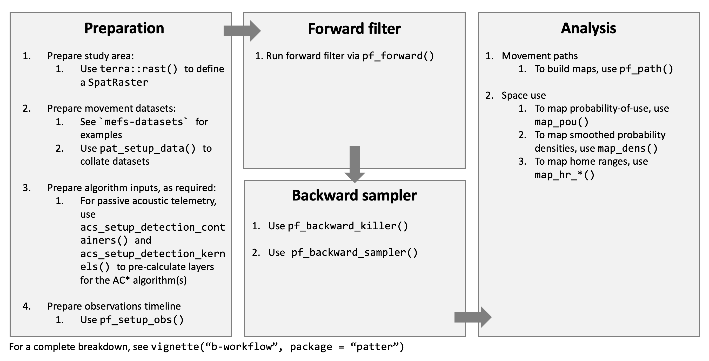

```{r, include = FALSE}
knitr::opts_chunk$set(
  collapse = TRUE,
  comment = "#>", 
  dpi = 300,
  out.width = "95%", 
  fig.align = "center"
)
```

# Introduction 

The `patter` package is a forward filtering--backward sampling algorithm for reconstructing movements and patterns of space use for tagged animals in passive acoustic telemetry systems (Lavender et al., 2023). For a introduction to the methodology, see the methodology vignette (type `vignette("a-methodology", package = "patter")`). This vignette exemplifies the basic workflow via `patter`. Its purpose is simply to illustrate how functions fit together. For full details and additional functionality, see the package/function documentation. 


**Figure 1. The workflow for `patter`.** This comprises four main steps: data preparation, forward filtering, backward sampling and analysis. In data preparation, we prepare the data for analysis and pre-compute necessary algorithm inputs. In forward filtering, we simulate possible locations of an individual, given the data and a movement model, moving forwards in time. In backwards sampling, we further refine the set of simulated locations. We can then analyse reconstructed movement paths and patterns of space use. 

# Packages

Let's start by loading and attaching some essential `R` packages.

```{r setup, message = FALSE, warning = FALSE}
library(patter)
library(data.table)
library(dtplyr)
library(dplyr)
library(lubridate)
library(spatstat.explore)
op <- options(patter.verbose = FALSE)
```

# Preparation

## Prepare study area

The first step is to define a grid over the study area. Here, we use an in-built bathymetry `SpatRaster` to represent the study area, but any grid is acceptable. `NA` defines inhospitable habitats (land in this case). Movements and likelihoods are represented on the grid, so it is desirable to use a relatively fine resolution where possible (especially since the speed of the forward simulation is (largely) independent of grid resolution).

```{r}
(gebco <- terra::disagg(dat_gebco(), 4))
terra::plot(gebco, main = "Study area")
```

## Prepare movement datasets

The next step is to prepare the movement datasets. In this vignette, we use a small sample of acoustic and archival (depth) time series from flapper skate (_Dipturus intermedius_) to reconstruct movement paths and patterns of space use. However, these choices are not mandatory and in fact you can include other datasets easily in existing routines. See the `sim_*()` functions to simulate data instead. For real-world analyses, start with a short (e.g., one day) time series and a single individual to develop the workflow. 

```{r}
# Set seed
set.seed(123L)

# Define a sample of acoustic time series 
acc  <- dat_acoustics[individual_id == 25, ]
head(acc)

# (optional) Define a sample of archival time series
arc  <- dat_archival[individual_id == 25, ]
head(arc)

# (optional) Align datasets for convenience 
start  <- max(c(min(acc$timestamp), min(arc$timestamp)))
end    <- min(c(max(acc$timestamp), max(arc$timestamp)))
period <- lubridate::interval(start, end)
acc    <- acc[timestamp %within% period, ]
arc    <- arc[timestamp %within% period, ]

# Define passive acoustic telemetry receiver locations 
# * (optional) For speed, we focus on relevant receivers
# * Note the receiver_range column that defines detection range
# * This is a key piece of information we have to provide
moorings  <-
  dat_moorings |>
  mutate(int = lubridate::interval(receiver_start, receiver_end)) |>
  filter(lubridate::int_overlaps(int, period)) |>
  as.data.table()
```

Use `pat_setup_data()` to collect data for `patter` functions. This function is used to set up movement datasets, spatial datasets and associated parameters for all patter functions. It ensures that user inputs meet `patter` requirements and streamlines the implementation of downstream functions. 

```{r}
dlist <- pat_setup_data(.acoustics = acc, 
                        .moorings = moorings,
                        .archival = arc, 
                        .bathy = gebco, 
                        .lonlat = FALSE)
```

To simplify the user-interface in patter, downstream patter often expect this data list as the data (`.dlist`) argument and extract the required elements. This also provides a flexible means to extend existing functionality because you can include new elements in `dlist` which are automatically available under-the-hood. We will use this trick below to store additional layers for likelihood functions. 

## Prepare movement and observation models 

`patter` reconstructs movement paths and patterns of space use, accounting for movement and observations, such as acoustic detections and archival data (see the `a-methodology` vignette). Movement is handled by a movement model and observations are handled by likelihood functions. 

The movement model describes the probability of moving between two locations. In `patter`, we need to specify a `mobility` parameter, which is the maximum distance an individual could move in a single time step, alongside random generation functions (that simulate movements into new locations) and probability density functions (that calculate the probability density of movements between locations). Typically, we assume that the probability of movement between two locations depends on the distance between them, but it may also depend on the individual's behavioural state and other variables. 

The observation models are used to evaluate the likelihood of the data in proposal locations. The observation model for acoustic data requires us to estimate detection range (i.e., the  distance beyond a receiver at which detection probability becomes zero) and describe how detection probability is distributed around a receiver. Observation models for other datasets will require additional models. 

In `patter`, the observation models are taken as given. Parameters are not estimated.

See Lavender et al. (2023) and Lavender et al., in prep for commentary on algorithm sensitivity to parameter values.

### Prepare movement model 

TO DO 

### Prepare observation models

`patter` includes convenience likelihood functions for acoustic and archival data. For ease of computation, the acoustic likelihood function(s) require us to pre-calculate the following objects: 

* Detection overlaps, which inform the distribution of detection probability;
* Detection kernels, which describe how detection probability is distributed around receivers;

We store them in `dlist$algorithm`, as required by the relevant routines. 

To compute detection overlaps, you need to have a record of receiver deployment timing and receiver locations. You also need to know (or guess) receiver detection ranges, which we  specified in `dlist$data$moorings`. 

```{r}
# Define detection overlaps from detection containers 
dlist$algorithm$detection_overlaps <- acs_setup_detection_overlaps(dlist)
```

To compute detection kernels, we need a model that describes that shape of the detection likelihood function around a receiver. Typically, we assume that detection probability declines logistically with distance as you move away from a receiver. Ideally, you will have some data from drift tests or sentinel tags that will guide the form of this model. Here, we use a model formulation designed for the flapper skate system:

```{r}
# Visualise an example detection probability model 
# * We use the default parameters here, 
# * ... but you should customise them for your system
ddetlogistic(.x = 1:1000, 
             .alpha = 4,    # intercept parameter
             .beta = -0.01, # gradient parameter
             .gamma = moorings$receiver_range[1]
             ) |> 
  plot( xlab = "Distance (m)", 
        ylab = "Detection probability", 
        type = "l")

# Visualise the spatial representation of the model around an example receiver
k <- acs_setup_detection_kernel(.mooring = dlist$data$moorings[1, ],
                                .bathy = gebco, 
                                .ddetx = ddetlogistic,
                                .alpha = 4, .beta = -0.01)
terra::plot(k)
```

Once you have a model, this is plugged into `acs_setup_detection_kernels()` which sets up the detection kernel objects as required.

```{r}
# Define detection kernels 
# * We use the default detection probability model here
# * But this should be adjusted as required for your study system
dlist$algorithm$detection_kernels  <-
  acs_setup_detection_kernels(dlist, 
                              .ddetkernel = acs_setup_detection_kernel)
```

To incorporate ancillary datasets, you need to be able to write down a model (`function`) for likelihood of the data, given particle samples (see `pf_lik` for guidance).

## Prepare timeline 

To implement the algorithms, we require a single time series, along which observations are recorded. `pf_setup_obs()` is used for this purpose. At the time of writing, this accepts acoustic and, optionally, archival time series, in the format defined above. These data are matched onto a single, regular time series, with a resolution of `.step` units and additional columns are created as required for the analysis. 

```{r}
obs <- pf_setup_obs(.dlist = dlist,
                    .step = "2 mins", 
                    .mobility = 500, 
                    .receiver_range = moorings$receiver_range[1])
obs <- obs[1:100, ]
head(obs)
```

To incorporate ancillary (e.g., archival) data, we may need to include additional columns in `obs` as required by the relevant likelihood functions. In our simulation, we'll account for the likelihood of depth observations using a binary likelihood function provided by `patter` (`pf_lik_dc()`). Under this model, depth observations in sampled locations where the bathymetric depth likes between a lower and upper depth limit are equally likely, whereas observations outside those limits are impossible (Lavender et al., 2023). To implement this model, here we use a depth-error model to define lower and upper depth limits. In this example, we have to include a 'fudge' factor to account for the low resolution of the bathymetry data.

```{r}
# (A) Define a depth-error model
fudge <- 10
cde <- function(.depth) {
  e <- 4.77 + 2.5 + sqrt(0.5^2 + (0.013 * .depth)^2) + fudge 
  matrix(c(-(e + 5), e), nrow = 2)
}
cde <- Vectorize(cde)

# (B) Pre-calculate depth limits for efficiency
obs <-
  obs |> 
  mutate(
    depth_shallow = depth + cde(depth)[1, ],
    depth_deep = depth + cde(depth)[2, ]) |>
  as.data.table()

# (C) Visualise depth-error model
p <- seq_len(nrow(obs))
plot(obs$timestep[p], obs$depth[p] * -1,
     ylim = range(c(obs$depth_shallow[p], obs$depth_deep[p]) * -1),
     xlab = "Time step", ylab = "Depth (m)",
     type = "l")
lines(obs$timestep[p], obs$depth_shallow[p] * -1, col = "lightblue")
lines(obs$timestep[p], obs$depth_deep[p] * -1, col = "darkblue")
```

# PF

## Forward simulation

The forward simulation samples set of locations (termed particles) at each time point, given the data up to (and including) that time point, and a movement model. This is implemented via `pf_forward()`. 

The main inputs to this function are:

* The observations timeline;
* A named `list` of datasets, as required to calculate likelihoods and simulate movement;
* Two proposal `function`s (the movement model), used to generate proposal locations;
* A named `list` of likelihood functions, used to evaluate the likelihood of the data given proposal locations;
* A sampling `function`, used to (re)sample locations with replacement;

For brevity, here we use a template movement model specified by `pf_rpropose_kick()` and in-built likelihood and sampling functions.

```{r}
# Implement ACDCPF algorithm 
out_pff <- pf_forward(
  # The timeline & supporting datasets
  .obs = obs,
  .dlist = dlist,
    # The movement model (using default parameters designed for flapper skate)
  .rpropose = pf_rpropose_kick,
  .dpropose = pf_dpropose,
  # ACDCPF likelihood components 
  .likelihood = list(acs_filter_land = acs_filter_land, 
                     acs_filter_container = acs_filter_container, 
                     pf_lik_ac = pf_lik_ac, 
                     pf_lik_dc = pf_lik_dc),
  # The sampler
  .sample = pf_sample_multinomial, 
  # Other settings
  .record = pf_opt_record(.save = TRUE))
```

`pf_forward()` returns a `pf_particles-class` object. Particle samples are stored in the `history` element of the output. We can plot the first few samples as follows:

```{r}
pp <- par(mfrow = c(2, 3))
lapply(1:6, \(i) {
  terra::plot(gebco, main = obs$timestep[i])
  xy <- terra::xyFromCell(gebco, out_pff$history[[i]]$cell_now)
  points(xy, col = "red")
}) |> invisible()
par(pp)
```

## Backward pass

`pf_backward_*()` implements the backward pass. 

```{r}
out_pfb <- pf_backward_killer(.history = out_pff$history, 
                              .record = pf_opt_record(.save = TRUE))
```

# Outputs

## Movement paths 

Particle samples can be used to reconstruct movement paths and build utilisation distributions. To reconstruct movement paths, use `pf_path()`:

```{r}
out_pfp <- pf_path(out_pfb$history, 
                   .bathy = gebco, 
                   .obs = obs, 
                   .cols = "depth")
head(out_pfp)
```

We can visualise an example path as follows:

```{r}
terra::plot(gebco)
p1 <- out_pfp[out_pfp$path_id == 1, ]
s  <- seq_len(nrow(p1))
arrows(x0 = p1$cell_x[s], x1 = p1$cell_x[s + 1],
       y0 = p1$cell_y[s], y1 = p1$cell_y[s + 1],
       length = 0.02)
```

## Utilisation distribution

To build a utilisation distribution, we can use `map_pou()` and/or `map_dens()`. We can also compute home range estimates via `map_hr_*()` functions. 

```{r}
## Define particle coordinates
coord <- pf_coord(.history = out_pfb$history, .bathy = gebco)

## Map POU (plus home range contours)
pou <- map_pou(.map = gebco, .coord = coord, .plot = TRUE)
mtext(side = 3, "map_pou()", line = 2)
map_hr_home(.map = pou, .add = TRUE)

## Map point density (plus home range contours)
dens <- map_dens(.map = gebco, .coord = coord, 
                 .plot = TRUE, 
                 sigma = bw.diggle)
mtext(side = 3, "map_dens()", line = 2)
map_hr_home(.map = dens, .add = TRUE)

## Map point density for centres of activity as comparison
# Extract acoustic detections for modelled observations 
obs_acc <- 
  obs |> 
  select(timestamp, receiver_id, detection) |>
  filter(detection == 1L) |> 
  as.data.table()
obs_acc <- obs_acc[, .(receiver_id = unlist(receiver_id)), by = .(timestamp)]
dlist_coa <- pat_setup_data(.acoustics = obs_acc, 
                            .moorings = moorings, 
                            .bathy = gebco, 
                            .lonlat = FALSE)
# Calculate COAs
coord_coa <- 
  coa(.dlist = dlist_coa, 
      .delta_t = "2 hours", 
      .plot_weights = FALSE) |> 
  select(x = coa_x, y = coa_y) |> 
  as.data.table()
# Map
dens_coa  <- map_dens(.map = gebco, .coord = coord_coa, 
                      .plot = TRUE, 
                      sigma = bw.diggle)
mtext(side = 3, "COA map_dens()", line = 2)
map_hr_home(.map = dens_coa, .add = TRUE)
```

```{r, include = FALSE}
options(op)
```

# References

Lavender. E. et al. (2023). An integrative modelling framework for passive acoustic telemetry. _Methods in Ecology and Evolution_. <https://doi.org/10.1111/2041-210X.14193>.
